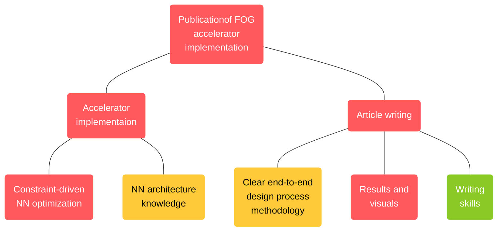
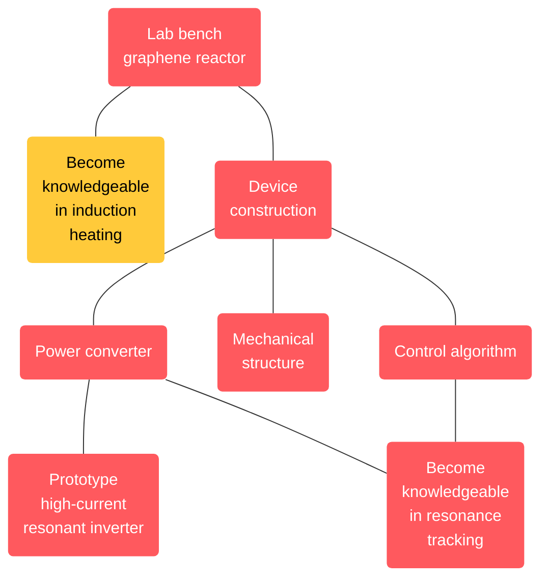
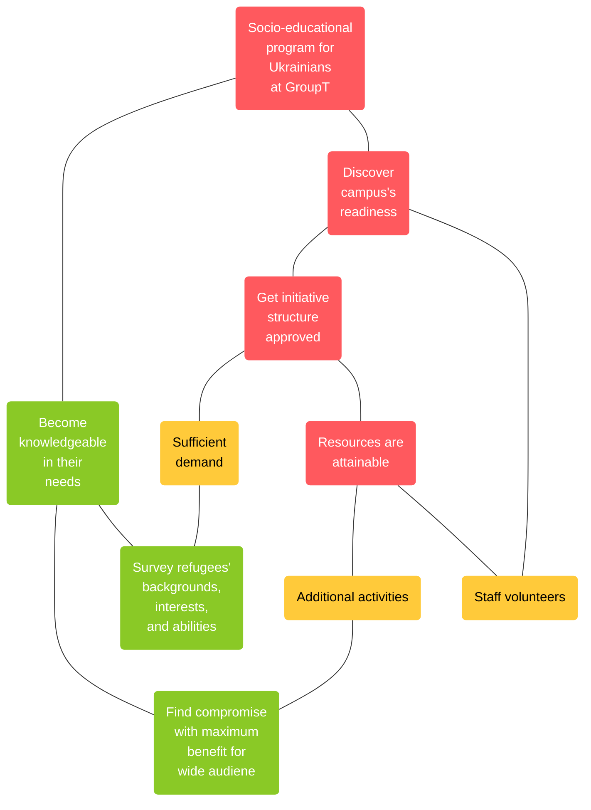
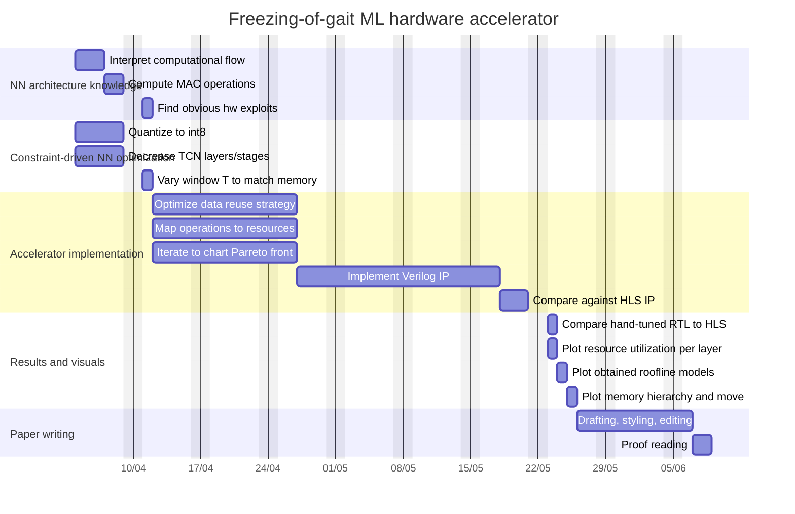

Created: 31-03-2022 00:53
Status: #summary #todo
Tags: [[Personal Development]] [[Time Management]]

# Time and Self-Management
## Progress
- [x] define Roles and allocate time slots
- [ ] complete SMART Goals
- [ ] complete Goal Trees
- [ ] complete Work Packages
## Methodology
1. Split ambitions and activities into distinctive life roles and allocate percentage of total time;
2. Define SMART goals for the roles;
3. Define a Goal Tree for each SMART goal;
4. Split each Work Package into tasks and estimate timing;
## Process
### Roles
#### Listed Activities
Listed activities that I do or wish to do: job, extracurricular activities, personal life, hobbies and interests, entrepreneurial ideas, side hustles, socio-educational initiatives, engineering contests, learning, etc.
#### Defined Roles
Define roles (all of them) for which complete weekly planning will be done and their corresponding desired percentages. It includes all of my personal ambitions, including academic, entrepreneurial, social, and family: the entire awake time budget (16h/d * 7d/wk = __112h/wk__) was then split across all of these roles in a seemingly fair way.  Note: Self and Time-Management ONLINE module recommends re-evaluating these percentages once every few months.
   
 ![[Time and Self-Management 1.png]]
 __Fig. 1.__ Mind map of my roles, boiled down from dreams and ambitions in life, as well as current project ideas I wish to realize in the next year. Roles are grouped into routine (left) and fulfillment (right). 
 
1. __Researcher__ - all academic and teaching duties the PhD job entails (literature review, paper writing, invigilation, lab teaching, master thesis guiding, PhD training, meetings, emails, etc.).
2. __Creator__ - all engineering, tinkering, programming, and designing activities for the hobby projects and entrepreneurial ideas (optionally inclusive of tinkering for academic projects which cannot be done as part of the "Researcher" role due to loose connection to the interests of the group, but is strongly linked to my ambitions, interests, and vision). Place to bring to life products and prototypes conceived by entrepreneurship dreams for personal projects and academia-related projects.
 <u>Note:</u> can also be used by tinkering done within the electronics club (as long as the project fits into one of the entrepreneurial ideas), and for video-editing for online (educational) content making (as long as it is used to build my own brand image and portfolio). 
3. __Learner__ - all technical, communication, and applied learning within my areas of interest (optionally inclusive of competences directly required by the "Researcher" role) to build knowledge and competences to achieve the ambitions and dreams the "Researcher", "Creator", "Entrepreneur" roles entail. 
4.  __Entrepreneur__ - dedicated time for commercialization of the ideas and prototypes developed within the "Creator" and "Researcher" roles; for networking with stakeholders; for pitching ideas; for finding growth, funding, and realization opportunities; for planning realization steps; for making pitch desks, presentations, etc. 
 <u>Note:</u> cannot be used by educational-social initiatives within the university community, like the electronics club or inter-university collaborations, communication, projects, supervision. 
5. __Family Member__ - personal time for a healthy life balance, including physical activity together with the family (climbing), and language classes.
 <u>Note:</u> might require an upsizing adjustment at the cost of downsizing other roles to have the time for other family activities. 
6. __Teacher__ - separate block for online learning content creation, editing, planning, and interacting.
 <u>Note:</u> can be absorbed by the "Creator" role, but is not recommended since it is subject to rob the role of precious time due to the nature of online content creation and editing. 
7. __Administrator__ - time for weekly reflection and planning of all the roles' tasks into the allocated weekly slots, including adjustment of plans, recalculation of role percentages, logging progress, updating Gantt charts, etc.
8. __Organizer__ - organizing formalities of the electronics club and voluntary internships with our research group; planning location and time; surveying and replying to students, staff and others; coming up with the theme; ordering components; meeting with relevant stakeholders; inviting and organizing guest lectures, company visits, and external internships. 
9. __Ambassador__ - meetings and organization of collaborations, exchanges, communication and other opportunities between universities (KU Leuven and UWI, at the moment); pitching and presenting; relaying information and emails to colleagues and the international office; proposing student projects and master theses; searching and announcing grant and funding opportunities for such international opportunities to stakeholders.   
#### Categorized Tasks
Categorized tasks for each role with the types of tasks.
1. Observed that my current roles consist of predominantly Q2 and Q3 tasks.
   ![[Time and Self-Management 2.png]] ^c08c4f
2. A lot of the Q2 tasks are without a deadline, resulting in frustrating procrastination.  ^55cb7d
3. Types of Q1 tasks are for the most part samples that are non-experienced or are rarely experienced.  ^14eb0d
4. I might prioritize tasks well on paper, but I let the little things fill up all the space and get continuously distracted or switch back and forth because of self-induced stress and anger that I don't work on the things that matter.
   ![[Time and Self-Management 3.png]] ^7ca470
5. All of my roles suffer from the same poor habits and have the same classification of tasks. ^a1f4e6
6. I am not happy with how I prioritize my work.
   ![[Time and Self-Management 4.png]] ^e83016
#### Mapped Tasks to the Eisenhower Matrix
### SMART Goals
#### Researcher
1. My goal for the next year is to have my first paper on the hardware accelerator implementation of a real-time freezing of gate (FOG) predictor based on the existing trained graph-temporal convolution neural network model, completed before the end of the second semester and published IEEE Journal of Biomedical and Health Informatics, which produces a workflow for mapping of an ML model to arithmetic operations, model tunning, and synthesis of the target RTL that could be later automated and scaled out for other applications as an end-to-end high-level synthesis toolchain. ^fd7d42
2. My goal for the next year is to have my second paper that proposes an improved multi-modal deep reinforcement learning model with aggregation of ubiquitous biosignals into a space embedding/observation latent space, for a fully automated insulin dosing device, fitting within the constraints, and being conceived within the co-design framework defined in the first paper, accepted before October 15th, 2022 in an appropriate international journal with a high impact factor that focuses on cross-disciplinary discussion of researchers within the area of diabetes technologies and therapeutics such as Lancet Diabetes and Endocrinology, Nature Biomedical Engineering, Nature Communications, Diabetes Technologies & Therapeutics or IEEE Journal of Biomedical and Health Informatics.
3. My goal for the next year is to have my third paper that fills the gap in the artificial pancreas research domain between state-of-the-art deep reinforcement learning models and underlying target hardware in a feasibility study that will guide ML model creation and adaptation for applicability on end-user hardware, submitted to and accepted by the Advanced Technologies and Treatments for Diabetes 2023 Conference before February 7th, 2023 to be published in the Diabetes Technologies & Therapeutics Journal.
4. My goal for the next year is to present intermediate results of the proposed multi-modal DRL model for fully-AID and its in-silico performance at the EUSIPCO 2022 Conference as a 3-minute paper, submitted and accepted before June 19th, 2022.
5. My goal for the next year is to apply for the FWO Strategic Basic PhD grant by March 1st, 2023 on the basis of intermediate results and achievements of the FOG and AID research and future promise of the envisioned end-to-end AI/ML HSL/HCL toolchains. 
6. My goal for the next year is to complete the System Verilog design of the RISC-V SoC with a custom AI accelerator, mechanism of which was proposed during my 2021 internship at Nokia Bell Labs, before May 28th.
7. My goal for the next year is to implement the dominant RISC-V core architecture IPs with accelerator hooks, data orchestration, and memory hierarchies to lay the foundation for the open-source RISC-V + accelerator IP synthesis toolchains in our research group, similar to ETH Zurich, on top of which further research projects and master theses can be built to grow and expand the knowledge base.
8. My goal for the next year is to implement a ML neural network as an Android and iPhone app that estimates macronutrients in food from images, in collaboration with Erika from UZ Leuven for use by diabetes patients, and with integration into the future planned fully-AID platform.
9. My goal for the next year is to define the component diagram of a modular end-to-end RTL/GDS synthesis toolchain of a heterogeneous RISC-V SoC with ML accelerators on-board, produced through an automated desig space exploration based on the accelerator templates or dedicated to the neural network used, before September 19th, 2022.
#### Creator
1. My goal for the next year is to produce a proof-of-concept palm-size surface chemistry lab bench induction heating reactor for deposition of graphene on sacrificial metal carrier plates for lab use by material science researchers, by September 1st, 2022. ^193e3d
2. My goal for the next year is to develop a simulation phase entry for the [MBZIRC](https://www.mbzirc.com/grand-challenge) UAV challenge before August, 2022, as part of a team of competent KU Leuven students, met in the organized electronics club, that performs obligatory tasks specified by the organizers (i.e. multi-UAV search and inspection, intra-swarm communication and collaborative decision-making, collective lift and transport to the base).
3. My goal for the next year is to create a proof-of-concept sequence or GAN model for audio signal requantization to use as a codec for audio reconstruction after lossy quantization to low bit widths, and as an audio quality enhancer, showcased at the EUSIPCO 2022 Conference as a 3-minute paper, submitted and accepted before June 19th, 2022.
4. My goal for the next year is to produce a proof-of-concept aggregation wearable for the fully-AID system for the use in the open diabetes framework, to be integrated with the ubiquity of body area network biosensors and other smart devices like insulin pump and smartphone, by December 31st, 2022.
5. My goal for the next year is to integrate the DRL-based fully AID control system, produced in the research role into the aggregation wearable, by December 31st, 2022.
#### Learner
1. My goal for this year is to complete the project of the course of computer architecture, the Hennesy's computer organization, the Krishna's data orchestration, and the Sze's deep learning accelerators books before April 18th, 2022. ^16b811
2. Complete the Deep RL YouTube course of UC Berkeley by Sergey Levine during the Easter break by April 18th, 2022. ^bcf60a
3. My goal is to complete the 2 RTOS Udemy courses and to solidify the ideas by writing my own RTOS for a RISC-V core runnable in an emulator, by end of semester 2. ^6edf7f
4. Explainability of AI/ML
5. RISC-V
6. Induction heating
7. Logo design
8. HDL
9. Multi-agent RL
10. maMIMO ML-based localization
#### Entrepreneur
1. My goal for the next year is to launch PayInMate and to start carrying out the MVP remittance service before December 31st, 2022. ^b2d5df
2. Get internship at Tesla, Tenstorrent, Untether, Graphcore, or Cerebras based on the portfolio developed throughout the year for the summer-fall of 2022.
#### Family Member 
1. 
#### Teacher
1. Oranize the socio-educational initiative for Ukrainian refugees at Group T before April 18th. ^691bb1
2. My goal for the next year is to document the R&D process of projects mentioned in the "Creator" goals to compose educational and entertainment online content for my own YouTube channel, portfolio, and brand building, publishing progress content shortly after the completion of significant milestones of a project.
3. My goal for the next year is to publish educational university-level technical content on YouTube as high quality talking heads and screen-casting videos aimed at providing information currently missing on the web, connecting the dots of how different topics in engineering come together in these advanced concepts, thereby creating value to the viewer and growing the audience.
4. Electronics club and corresponding online content.
#### Administrator
1. Maximize effectiveness. ^e39e60
2. Achieve work-life balance that yields a feeling of fulfillment, productivity and healthy well-being
#### Organizer
1. e-Media webpage for our research group. ^25d009
#### Ambassador
1. Relationship with UWI. ^2aae02
### Goal Trees
- __\#ff595e__ - Red _(not started)_
- __\#ffca3a__ - Yellow _(ongoing)_
- __\#8ac926__ - Green _(finished)_
#### Researcher

^d62710

#### Creator

^97af5a

#### Teacher

^263974

### Work Packages
#### Researcher
Freezing-of-gait ML hardware accelerator (__11.8 weeks__)

\# | WP | Time (weeks)
- | - | -
A | __NN architecture knowledge__ \|--A.1 Interpret computational flow \|--A.2 Compute # MAC operations \|--A.3 Find obvious hw exploits | 1.2 0.6 0.4 0.2
B | __Constraint-driven NN optimization__ \|--B.1 Quantize to int8 \|--B.2 Decrease # TCN layers/stages \|--B.3 Vary window T to match memory| 2.2 1 1 0.2
C | __Accelerator implementation__ \|--C.1 Optimize data reuse strategy \|--C.2 Map operations to resources \|--C.3 Iterate to chart Parreto front \|--C.4 Implement Verilog IP \|--C.5 Compare against HLS IP | 5.8 1 0.2 1 3 0.6
D | __Results and visuals__ \|--D.1 Compare hand-tuned RTL to HLS \|--D.2 Plot resource utilization per layer \|--D.3 Plot obtained roofline models \|--D.4 Plot memory hierarchy and move | 0.6 0.1 0.2 0.1 0.2
E | __Paper writing__ \|--E.1 Drafting, styling, editing \|--E.2 Proof reading | 2 1.6 0.4

^525e81

### Planning
#### Waterfall vs Agile
- Waterfall = serialization;
- Agile = continuous development;

Waterfall + Agile = strategic serialization with tactical iterative planning.

#### Retro vs Forward Planning
- Retro = bottom-up. Planning in reverse, from deadline to today. Deadline and goal oriented/driven.
  <u>Note:</u> Prevents underemphasizing last steps of a project;
- Forward = duration estimate-driven. Tends to take longer than a Retro planned project.
  <u>Note:</u> Prone to underemphasize middle to end parts of a project;
#### Task Dependencies
Freezing-of-gait ML hardware accelerator

\# | WP | Time (weeks) | Dependencies
- | - | - | -
A | __NN architecture knowledge__ | 1.2 | /
B | __Constraint-driven NN optimization__ | 2.2 | /
C | __Accelerator implementation__ | 6.4 | A, B; Agile with D
E | __Paper writing__ | 2 | D

#### Timing Diagram
